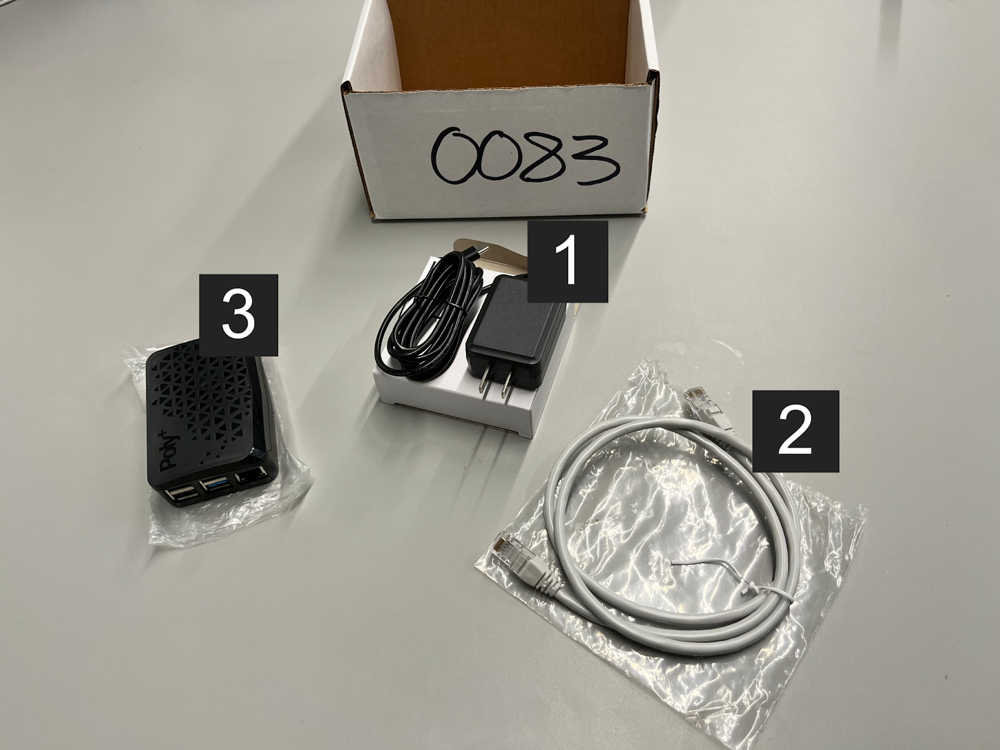
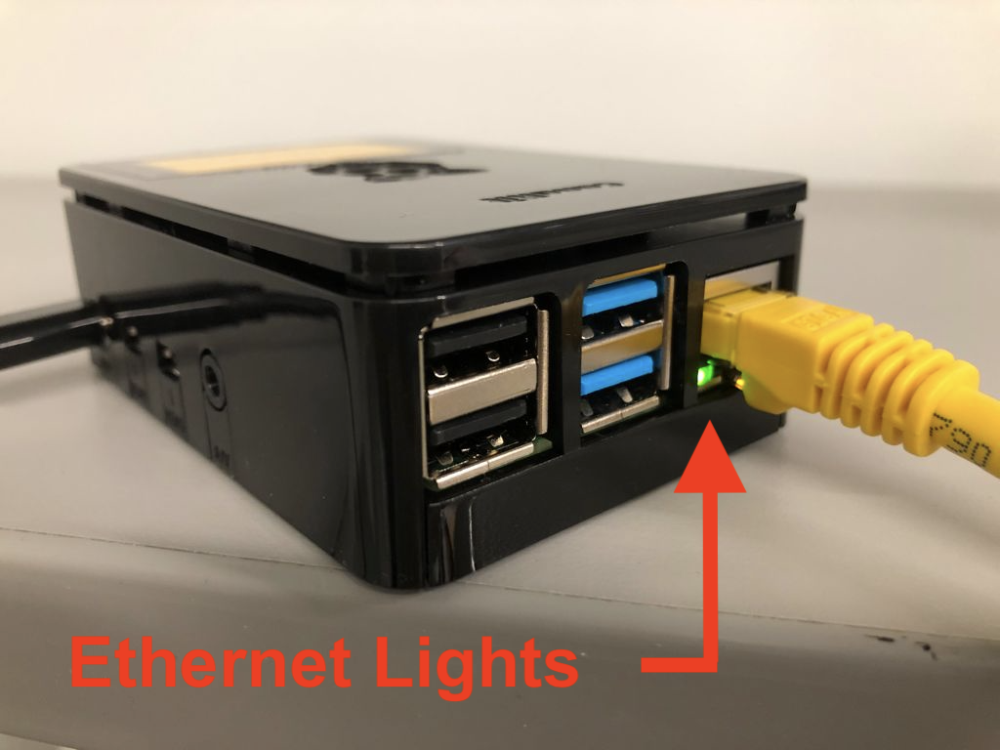
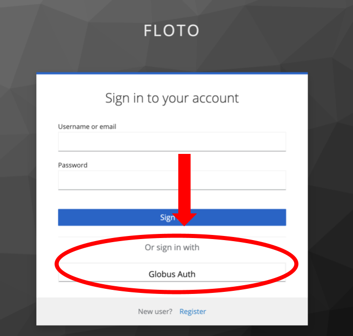
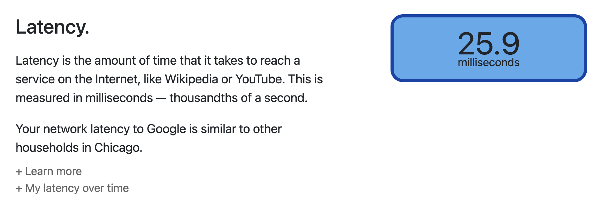

# Getting Started

This guide will walk you through the initial steps of setting up a device, getting access to the FLOTO dashboard, and deploying an application to it.

## Step 1: Setting Up a Device

The fastest way to get set up with a device is to contact us at contact@floto.science and request a pre-assembled FLOTO device kit with all the hardware and software you'll need out of the box. If you instead wish to add your own device to FLOTO, please contact us at the same email and we will send you the base image to flash your device.



The FLOTO kit, pictured above, will include:
1. A power adapter (black)
2. An ethernet cable (gray)
3. A Raspberry Pi

Once you have a FLOTO kit, you will neeed to install the device on a router or router/modem combo to connect it to the Internet. First, at the location where you wish to deploy the device, locate the source of your Internet connectivity.

> ⚠️ Do not connect the device to a WiFi extender or other networking equipment other than a router or modem/router combo. This is particularly important for collecting sound Internet performance data using the device. 

Connect the ethernet port on your router/modem to the ethernet port on the Raspberry Pi using the gray cable. Next, connect the power adapater to the side of the Raspberry Pi, and plug it into the power outlet. 

You should see a red light come on immediantly on the Pi. Next to the ethernet port on the Pi, you should also see blinking green and yellow lights.



Next, you'll set up your FLOTO portal account.

## Step 2: Portal Access

To get access to the FLOTO infrastructure, first visit the [portal](https://portal.floto.science), and then sign in with Globus Auth. This will allow you to select an organization login (typically your intitution) or via Google. 



After doing this, our team will need to approve your new account. To request approve, please send a message to contact@floto.science from the email you signed up with. 

You'll also need a project to use FLOTO. If you need a new project, please mention this during your initial message. If you are collaborating with group already using FLOTO, the PI of that group will be able to add you to it. Please mention the name of any device you set up as well.

Once granted access, you only be able to access devices that device operators have either made public, or given you access to. You will be able to browse the list of all devices, and filter by devices you operate and the ones you can deploy applications to. 

> ⚠️ Make sure that your project name is active before continuing. It should appear in the middle of the top navigation bar. If it does not, [go to your profile](http://portal.floto.science/dashboard/user), and click "Set Active Project"

## Step 3: Deploying an Application

In this step, we'll deploy an application called [Netrics](https://github.com/internet-equity/netrics) that runs various network measurements, such as ping and speed tests. 

To deploy the application onto a device, navigate to the [jobs page](http://portal.floto.science/dashboard/jobs) on the portal. Scroll down to the "New Job" form. Step through the form as follows.

1. Search for the application name "FLOTO Getting Started" and select it. Leave the visibility as "Project-Only". Click continue.
2. Scroll down to the "New Timing" section. You can click on the calendar and clock to choose an end date for your application deployment. The application will run from the moment you submit the job to the end date that you select in this step. To start, we recommend choosing tomorrow's date on the calendar, and then clicking on the small clock icon to pick the current time. You'll see on the right `Expires in 0 days, 23 hours, 59 minutes`, indicating that you've input 1 day from now as the end time. Under this text, click "Add" to confirm, and click continue.
3. Click on your device name (e.g., `FLOTO_RPI_0100`) to select it for your job. Scroll down to the bottom of the page. Click continue.
4. Click submit. A green popup should appear saying your job was successfully created.

If you scroll back up to the top of the page, you'll see your job in the first row of the "My Jobs" table. On the very right of this table (you may need to horizontally scroll depending on your screen), click on the "eye" icon in your job's row. This shows your job's overview. Under "Events" you should see that the service containers were deployed successfully. Your device now is collecting broadband data.

## Step 4: Viewing Collected Data

The application from step 3 has two services. The first is the container that collects the network measurements. The second container runs a local web server to display a dashboard with the results of your local network measurements. The web server serves the dashboard at a local domain listening on port 30001. If you are on the same local network as your device, you'll be able to connect to the dashboard.

On the [device overview page](https://portal.floto.science/dashboard/devices), find the entry of the device you selected in step 3. Select the "eye" icon to view the device's details. You will see a list of IP addresses for your device. The first entry on this list likely is the local network's IP for the device, and it will most likely start with `192.168.` or `10.0.` (any address that begins with `10.42.` are internal to FLOTO, and NOT the addresses you should use). Copy it, and in another tab go to the address `http://w.x.y.z:30001`, where `w.x.y.z` is replaced with the IP you copied. You should be taken to a web page displaying the data your device collected. It may take up to an hour for this data to propagate, as the measurements are run intermittently to avoid network interference.



## Step 5 (optional): Uploading collected data

As mentioned before, the application from step 3 runs two services, one to collect network measurements, and another that runs the dashboard webserver. Under the hood, this works [via a shared volume between the two services](https://github.com/UChicago-FLOTO/docs/blob/master/user/application_user.md#create-an-application). The measurement results are simply written to files to this directory, and the web server parses these and presents them in a user friendly way. 

If you are interested in the data from these raw files, one way to access it would be to run an additional service that uploads these to a cloud storage. For such purposes, we have a sample service [data_uploader](https://github.com/UChicago-FLOTO/data_uploader/blob/main/README.md#data-uploader) that can be used. We've created another demo application which links these services together. Unlike the last application, it requires some configuration to use.

### Configuring rclone

As described in this service's documentation, it needs an [rclone](https://rclone.org/) configuration. [Rclone's docs](https://rclone.org/docs/#configure) provide details about how to configure most cloud providers, here, I'll describe how to use storage from the Chameleon testbed. If you are using AWS, GCP, or another remote storage endpoint, follow the [instructions from rclone](https://rclone.org/docs/#configure), and then continue to the next section.

Chameleon is an NSF funded cloud testbed. One of the services it provides is an S3-compatible object store. 

If you are not yet a Chameleon user, in order to get access to the object store, you'll first need to follow [steps 1 & 2 of the getting started](https://chameleoncloud.readthedocs.io/en/latest/getting-started/index.html#getting-started) to get access. 

Next, you'll need to [configure the Chameleon CLI](https://chameleoncloud.readthedocs.io/en/latest/technical/cli.html#command-line-interface-cli). Follow the steps to install the CLI, set up a password, and to download an OpenStack RC Script for the CHI@TACC site. Additionally, you'll need to install [rclone](https://rclone.org/).

Now, after sourcing your openrc script, you can run the command

```
openstack ec2 credential create
```

which will give you a credential ID and secret. Remember these values.

Now, run `rclone config` and select to create a new remote, and name it `floto`. Then answer the rclone prompts as follows:
```
storage> s3
provider> Other
env_auth> false
access_key_id> Enter your credential ID from above.
secret_access_key> Enter your secret from above.
region> CHI@TACC
endpoint> https://chi.tacc.chameleoncloud.org:7480
location_constraint> (leave blank)
acl> (leave blank)
```
And then select `n` regarding advanced config. Confirm your entry with `y`, and then enter `q` to quit config.

Confirm your configuration is correct by now running `rclone lsd floto:`. If no error occurs, everything is correct.

### Configuring the data uploader

We'll now create a new job that includes the data uploader. Navigate back to [jobs page](http://localhost:8080/dashboard/jobs). This time, select "FLOTO Getting Started with Uploader" as your application. Answer as you did above in step 3 for the timing and device forms. Before submitting, on the Environment section enter the following:

1. Under key, enter `DIRECTORY`. Under value, enter `/share/result/`. Click the `+` icon. This is linking the data uploader directory to the results directory from the measurement service.
2. Again, under key, enter `RCLONE_CONFIG_JSON`. In your terminal get the JSON configuration from your rclone remote (assuming it is named `floto`) by running `rclone config dump | jq -c .floto` (you may need to install `jq`, or change the argument to your remote's name from `floto`). Paste this output into the value input, and click the `+` icon.

Now, you can submit. It may take a few minutes, but if you now run the command `rclone lsd floto:` in your terminal, you will see data from the netrics measurements. 

# Next steps

Please see individual pages for different FLOTO use cases. 
You may also browse the 
[FLOTO API documentation](https://portal.floto.science/api/schema/swagger-ui/).

* [Device operators](device_operator.md) - For users who are managing devices, and want to configure and inspect running floto devices.
* [Application users](application_user.md) - For users who want to deploy applications on FLOTO devices.