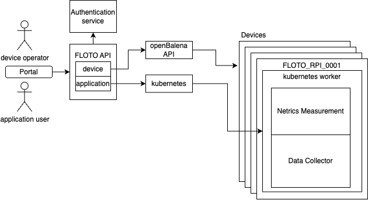

# Architecture

A diagram of the FLOTO architecture is given below.

The [FLOTO API](https://portal.floto.science/api/schema/swagger-ui/#/) is the underlying service that powers the infrastructure. Typically, users interact via the web portal, which uses this API under the hood. The API connects to an external authentication service, which logs in users via [Globus auth](https://docs.globus.org/api/auth/specification/), and also supports authentication via API tokens.

This API has 2 components:
1. The device management component, mainly used by device operators to check the devices connectivity, verify peripheral installation, and configure metadata. This is built on top of [openBalena](https://www.balena.io/open).
2. The application component, which allows for users to create applications and deploy jobs to devices. This is built on top of Kubernetes.

The architecture of these components is described in more detail below.

## Device API

In order to manage devices remotely, device management is built on top of openBalena. This maintains a VPN connection between our API and the device, permitting for remote command execution, and deployment of application management framework to the device. The openBalena OS installed on the devices is configured to download this application management framework, which is what makes it possible for application users to deploy their applications to devices. 

The `is_online` status shown in the device API indicates whether the device is communicating with the openBalena backend, while the `is_ready` status indicates whether the application framework is running.

## Application API

In order to run applications, devices run a application framework. Essentially, this installs a kubernetes worker service on the device, and enrolls it into a larger cluster with all devices. When a job is created, a kubernetes deployment is submitted to this cluster, which creates containers based on the job's application. For example, the Netrics application would run two containers under this worker service: a measurement container, and a data collector. 